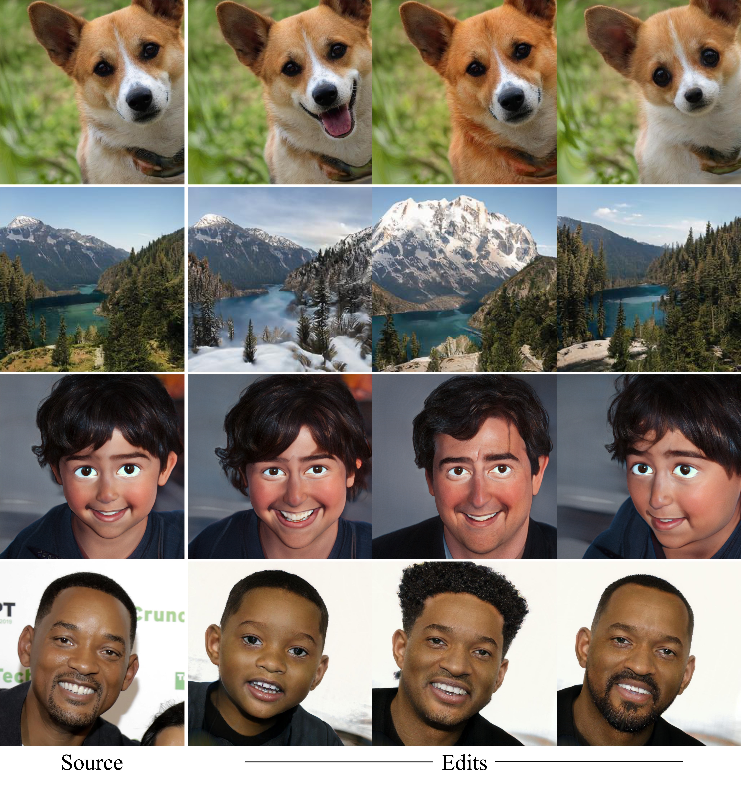
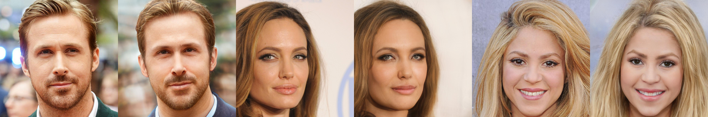
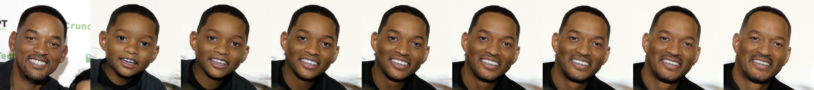
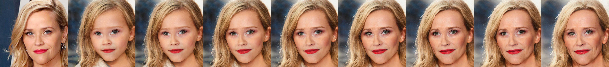
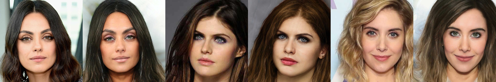
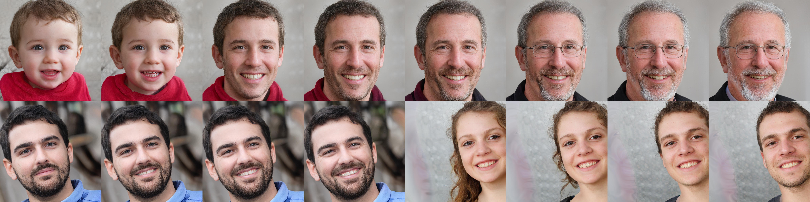
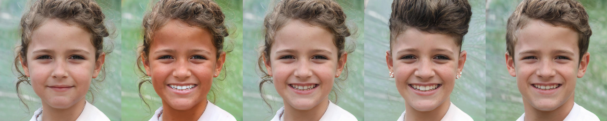
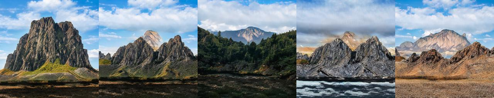
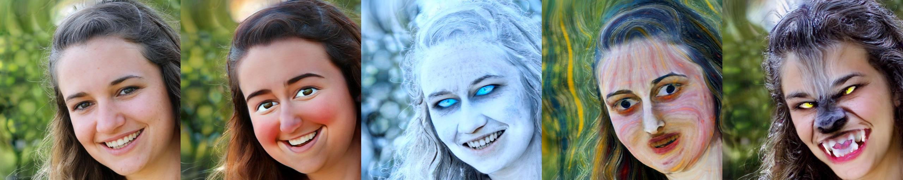
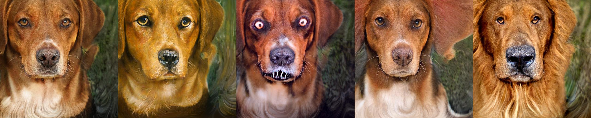

# Third Time's the Charm? Image and Video Editing with StyleGAN3 (AIM Workshop ECCV 2022)

> Yuval Alaluf*, Or Patashnik*, Zongze Wu, Asif Zamir, Eli Shechtman, Dani Lischinski, Daniel Cohen-Or  
> *Denotes equal contribution  
> 
> StyleGAN is arguably one of the most intriguing and well-studied generative models, demonstrating impressive performance in image generation, inversion, and manipulation. In this work, we explore the recent StyleGAN3 architecture, compare it to its predecessor, and investigate its unique advantages, as well as drawbacks. In particular, we demonstrate that while StyleGAN3 can be trained on unaligned data, one can still use aligned data for training, without hindering the ability to generate unaligned imagery. Next, our analysis of the disentanglement of the different latent spaces of StyleGAN3 indicates that the commonly used W/W+ spaces are more entangled than their StyleGAN2 counterparts, underscoring the benefits of using the StyleSpace for fine-grained editing. Considering image inversion, we observe that existing encoder-based techniques struggle when trained on unaligned data. We therefore propose an encoding scheme trained solely on aligned data, yet can still invert unaligned images. Finally, we introduce a novel video inversion and editing workflow that leverages the capabilities of a fine-tuned StyleGAN3 generator to reduce texture sticking and expand the field of view of the edited video.

<a href="https://arxiv.org/abs/2201.13433"></a>
<a href="https://opensource.org/licenses/MIT"></a>  

Inference Notebook: <a href="http://colab.research.google.com/github/yuval-alaluf/stylegan3-editing/blob/master/notebooks/inference_playground.ipynb"></a>  

<p align="center">
  
<br>
Using the recent StyleGAN3 generator, we edit unaligned input images across various domains using off-the-shelf editing techniques. Using a trained StyleGAN3 encoder, these techniques can likewise be used to edit real images and videos.
</p>

# Description   
Official implementation of our StyleGAN3 paper "Third Time's the Charm?" where we analyze the recent StyleGAN3 generator and explore its advantages over previous style-based generators. We evaluate StyleGAN3's latent spaces, explore their editability, and introduce an encoding scheme for inverting and editing real images and videos. 

# Table of Contents
- [Getting Started](#getting-started)
  * [Prerequisites](#prerequisites)
  * [Installation](#installation)
  * [Inference Notebook](#inference-notebook)
- [Preparing Your Data](#preparing-your-data)
- [StyleGAN3 Encoder](#stylegan3-encoder)
  * [Training](#training)
  * [Inference and Evaluation](#inference-and-evaluation)
    + [Inversion](#inversion)
    + [Inversion Animation](#inversion-animation)
    + [Computing Metrics](#computing-metrics)
  * [Editing Real Images](#editing-real-images)
    + [InterFaceGAN](#interfacegan)
    + [StyleCLIP Global Directions](#styleclip-global-directions)
  * [Pivotal Tuning Inversion (PTI)](#pivotal-tuning-inversion--pti-)
  * [Inverting and Editing Videos](#inverting-and-editing-videos)
    + [Inference](#inference)
    + [PTI Training on Videos](#pti-training-on-videos)
    + [Field of View Expansion](#field-of-view-expansion)
- [Editing](#editing)
  * [InterFaceGAN](#interfacegan-1)
    + [Pre-trained InterFaceGAN Boundaries](#pre-trained-interfacegan-boundaries)
    + [Training Your Own InterFaceGAN Boundaries](#training-your-own-interfacegan-boundaries)
    + [Editing Synthetic Images with InterFaceGAN](#editing-synthetic-images-with-interfacegan)
  * [StyleCLIP](#styleclip)
    + [StyleCLIP Latent Mapper](#styleclip-latent-mapper)
    + [StyleCLIP Global Directions](#styleclip-global-directions-1)
      - [Preprocessing](#preprocessing)
        * [Editing](#editing-1)
- [StyleGAN-NADA](#stylegan-nada)
- [Acknowledgments](#acknowledgments)
- [Citation](#citation)

<small><i><a href='http://ecotrust-canada.github.io/markdown-toc/'>Table of contents generated with markdown-toc</a></i></small>


# Getting Started
## Prerequisites
- Linux or macOS
- NVIDIA GPU + CUDA CuDNN (CPU may be possible with some modifications, but is not inherently supported)
- Python 3

During the building of this repository, we decided to replace all uses of `argparse` with `dataclasses` and
[`pyrallis`](https://github.com/eladrich/pyrallis). Using `dataclasses` provides useful features such as type hints 
and code completion. We believe this has helped make the code cleaner and we hope you enjoy just as much as we do!

To learn more, check out the [pyrallis repository](https://github.com/eladrich/pyrallis).

## Installation
- Dependencies:  We recommend running this repository using [Anaconda](https://docs.anaconda.com/anaconda/install/).  
All dependencies for defining the environment are provided in `environment/sg3_env.yaml`.

## Inference Notebook
Check out our [inference notebook](https://colab.research.google.com/github/yuval-alaluf/stylegan3-editing/blob/master/notebooks/inference_playground.ipynb) for inverting and editing real images with StyleGAN3. 


# Preparing Your Data
In this repo, we work with images that are both aligned and cropped (unaligned). 
Given a directory of raw images, you can prepare your data by running the script `prepare_data/preparing_faces_parallel.py`.
For example, for preparing your aligned data, you can run: 
```
python prepare_data/preparing_faces_parallel.py \
--mode align \ 
--root_path /path/to/raw/images
```
Similarly, to obtain unaligned data, you can run: 
```
python prepare_data/preparing_faces_parallel.py \
--mode crop \
--root_path /path/to/raw/images \
--random_shift 0.05
```
Given the aligned and unaligned images, we can then compute the transformations between each pair of images.  
To compute these landmarks, you can run the following command: 
```
python prepare_data/compute_landmarks_transforms.py \
--raw_root /path/to/root/data \
--aligned_root /path/to/aligned/data \
--cropped_root /path/to/unaligned/data \
--output_root /path/to/directory/to/save/transforms/to/
```
The aligned data, unaligned data, and landmarks-based transforms will be used in various applications such as inverting 
unaligned images and editing unaligned images.


# StyleGAN3 Encoder
We provide our pretrained StyleGAN3 encoder trained over ReStyle-pSp and ReStyle-e4e using the FFHQ dataset. The models
can be downloaded from the following links: 

| Path | Description
| :--- | :----------
|[ReStyle-pSp Human Faces](https://drive.google.com/file/d/12WZi2a9ORVg-j6d9x4eF-CKpLaURC2W-/view?usp=sharing)  | ReStyle-pSp trained on the [FFHQ](https://github.com/NVlabs/ffhq-dataset) dataset over the StyleGAN3 generator.
|[ReStyle-e4e Human Faces](https://drive.google.com/file/d/1z_cB187QOc6aqVBdLvYvBjoc93-_EuRm/view)  | ReStyle-e4e trained on the [FFHQ](https://github.com/NVlabs/ffhq-dataset) dataset over the StyleGAN3 generator..

In addition, we provide various auxiliary models needed for training your own encoders models from scratch.  
This includes the StyleGAN generators converted to `.pt` format and pre-trained models used for loss computation and encoder backbone.

| Path | Description
| :--- | :----------
|[FFHQ Aligned StyleGAN3](https://drive.google.com/file/d/13q6m-bpe3Ws9en9y45JEx2PHQirStt8N/view?usp=sharing) | StyleGAN3 model trained on FFHQ with 1024x1024 output resolution and saved as `.pt` file.
|[FFHQ Unaligned StyleGAN3](https://drive.google.com/file/d/1Xfi0mBgiDb8AUazWok9eKSRQon9YVMMW/view?usp=sharing) | StyleGAN3 model trained on FFHQU with 1024x1024 output resolution and saved as `.pt` file.
|[AFHQ StyleGAN3](https://drive.google.com/file/d/1VJqu7Dy20W0RcrrR9TjQRdaFa52NSMn7/view?usp=sharing) | StyleGAN3 model trained on AFHQv2 with 512x512 output resolution and saved as `.pt` file. Model is taken from the [official StyleGAN3 repository](https://github.com/NVlabs/stylegan3).
|[Landscapes HQ StyleGAN3](https://drive.google.com/file/d/1rfZgRDl9Xjri1tz3IHMyvkL3o_fnUUR8/view?usp=sharing) | StyleGAN3 model trained on Landscapes HQ with 256x256 output resolution and saved as `.pt` file. Model taken from [Justin Pinkney](https://github.com/justinpinkney/awesome-pretrained-stylegan3/blob/main/README.md). 

| Path | Description
| :--- | :----------
|[IR-SE50 Model](https://drive.google.com/file/d/1KW7bjndL3QG3sxBbZxreGHigcCCpsDgn/view?usp=sharing) | Pretrained IR-SE50 model taken from [TreB1eN](https://github.com/TreB1eN/InsightFace_Pytorch) for use in our ID loss and encoder backbone on human facial domain.
|[CurricularFace Backbone](https://drive.google.com/file/d/1f4IwVa2-Bn9vWLwB-bUwm53U_MlvinAj/view?usp=sharing) | Pretrained CurricularFace model taken from [HuangYG123](https://github.com/HuangYG123/CurricularFace) for use in ID similarity metric computation.
|[MTCNN](https://drive.google.com/file/d/1tJ7ih-wbCO6zc3JhI_1ZGjmwXKKaPlja/view?usp=sharing) | Weights for MTCNN model taken from [TreB1eN](https://github.com/TreB1eN/InsightFace_Pytorch) for use in ID similarity metric computation. (Unpack the tar.gz to extract the 3 model weights.)

Note: while you may use the official StyleGAN3 `pkl` files, we highly recommend using our provided `.pt` generators. The 
generators themselves are identical, but using the `pt` files provide more flexibility.

By default, we assume that all auxiliary models are downloaded and saved to the directory pretrained_models. 
However, you may use your own paths by changing the necessary values in `configs/path_configs.py`.

## Training 
Recall, that our encoders are trained solely on **aligned** data. After training is complete, we can perform inference 
on both **aligned** and **unaligned** data by using the user-specified transformations supported by StyleGAN3.

To prepare your data configs, we refer the reader to the [ReStyle repository](https://github.com/yuval-alaluf/restyle-encoder#preparing-your-data) 
which we follow.

To train our ReStyle-pSp encoder, you can run the following command: 
```
python inversion/scripts/train_restyle_psp.py \
--dataset_type ffhq_encode \
--encoder_type BackboneEncoder \
--exp_dir experiments/restyle_psp_ffhq_encode \
--batch_size 2 \
--test_batch_size 2 \
--workers 8 \
--test_workers 8 \
--val_interval 5000 \
--save_interval 10000 \
--start_from_latent_avg True \
--lpips_lambda 0.8 \
--l2_lambda 1 \
--id_lambda 0.1 \
--input_nc 6 \
--n_iters_per_batch 3 \
--output_size 1024 \
--stylegan_weights pretrained_models/sg3-r-ffhq-1024.pt
```

Similarly training a ReStyle-e4e encoder can be run with the following command: 
```
python inversion/scripts/train_restyle_e4e.py \
--dataset_type ffhq_encode \
--encoder_type ProgressiveBackboneEncoder \
--exp_dir experiments/restyle_e4e_ffhq_encode \
--batch_size 2 \
--test_batch_size 2 \
--workers 8 \
--test_workers 8 \
--start_from_latent_avg True \
--lpips_lambda 0.8 \
--l2_lambda 1 \
--id_lambda 0.1 \
--w_discriminator_lambda 0.1 \
--use_w_pool True \
--input_nc 6 \
--n_iters_per_batch 3 \
--truncation_psi 0.7 \
--output_size 1024 \
--stylegan_weights pretrained_models/sg3-r-ffhq-1024.pt
```

Additional Notes: 
* All hyper-parameters are set as the defaults as used in ReStyle except that when training ReStyle-e4e we do not use the 
progressive training scheme.
* You should also adjust the `--output_size` and `--stylegan_weights` flags according to your StyleGAN3 generator.
* See `inversion/options/train_options.py` and `inversion/options/e4e_train_options.py` for all training-specific flags.


## Inference and Evaluation 

<p align="center">
  
<br>
Sample reconstructions for unaligned images obtained with our ReStyle encoders.
</p>

### Inversion
You can use `inversion/scripts/inference_iterative.py` to apply a trained model on a set of images. For example:
```
python inversion/scripts/inference_iterative.py \
--output_path experiments/restyle_e4e_ffhq_encode/inference \
--checkpoint_path experiments/restyle_e4e_ffhq_encode/checkpoints/best_model.pt \
--data_path /path/to/aligned_test_data \
--test_batch_size 4 \
--test_workers 4 \
--n_iters_per_batch 3 \
--landmarks_transforms_path /path/to/landmarks_transforms.npy
```
This script will save each step's outputs in a separate sub-directory and the iterative results side-by-side.  
Notes: 
* Note that the `--data_path` flag should point to your *aligned* data since this is the data that is passed to the encoder.
* If you are inverting unaligned images, you should specify the landmarks-based transforms using the flag 
`--landmarks_transforms_path`. 
    * When generating the final reconstruction, these transforms will be used to reconstruct the placement and rotation of the unaligned image. 
    * Follow the instructions above for preparing the `landmarks_transforms` file. 
    * Please note, if this file is not specified, then all outputs will be aligned. 
* By default, the images will be saved at their original output resolutions (e.g., 1024x1024 for faces). 
    * If you wish to save outputs resized to resolutions of `256x256`, you can do so by adding the flag `--resize_outputs=True`.

This script will also save all the latents as an `.npy` file in a dictionary format as follows: 
```
{
    "0.jpg": [latent_step_1, latent_step_2, ..., latent_step_N],
    "1.jpg": [latent_step_1, latent_step_2, ..., latent_step_N],
    ...
}
```
That is, the keys of the dictionary are the image file names and the values are lists of length `N` containing the output latent of each 
step where `N` is the number of inference steps. Each element in the list is of shape `(Kx512)` where `K` is the number
of style inputs of the generator. 

You can use the saved latents to perform latent space manipulations, for example.

### Inversion Animation
If you would like to create animations showing interpolations between the inversions of unaligned images 
(like those on the project page), you can run the script `inversion/scripts/create_inversion_animation.py`. For example, 
```
python inversion/scripts/create_inversion_animation.py \
--generator_path pretrained_models/sg3-r-ffhq-1024.pt \
--output_path experiments/restyle_e4e_ffhq_encode/inference/animations \
--latents_path experiments/restyle_e4e_ffhq_encode/inference/latents.npy \
--data_path /path/to/animation/data \
--landmarks_transforms_path /path/to/animation/data/landmarks_transforms.npy \
--n_images 10
```
Note that we assume that you have already run the inference script from above and have saved the saved latents to the 
path `--latents_path` (similarly for the landmarks transforms). By default, the script will randomly sample 
`n_images` from the `data_path` or use all images if `n_images` is `None`.


### Computing Metrics
Given a trained model and generated outputs, we can compute the loss metrics on a given dataset.  
These scripts receive the inference output directory and ground truth directory.
- Calculating L2/LPIPS/MS-SSIM losses and similarities:
```
python inversion/scripts/calc_losses_on_images.py \
--metrics "[lpips, l2, msssim]" \
--output_path /path/to/experiment/inference/inference_results \
--gt_path /path/to/test_images
```
- Calculating the identity loss for the facial domain: 
```
python inversion/scripts/calc_id_loss_parallel.py \
--output_path /path/to/experiment/inference/inference_results \
--gt_path /path/to/test_images
```

These scripts will traverse through each sub-directory of `output_path` to compute the metrics on each step's output images.


## Editing Real Images
For editing real images, we provide two techniques: InterFaceGAN and StyleCLIP's global directions. 

### InterFaceGAN
<p align="center">
  
 
<br>
Sample editing results for unaligned images obtained with our ReStyle-e4e encoder and InterFaceGAN. Additional results are provided in the project page.
</p>

For editing with **InterFaceGAN**, you can run the following command: 
```
python inversion/scripts/inference_editing.py \
--output_path /path/to/experiment/inference \
--checkpoint_path experiments/restyle_e4e_ffhq_encode/checkpoints/best_model.pt \
--data_path /path/to/test_data \
--test_batch_size 4 \
--test_workers 4 \
--n_iters_per_batch 3 \
--edit_directions "[age,pose,smile]" \
--factor_ranges "[(-5_5),(-5_5),(-5_5)]" \
--landmarks_transforms_path /path/to/landmarks_transforms.npy
```
This will run inversion and edit each image in the specified `data_path` using the trained encoder.  
Notes: 
* The edits supported by this script are defined in the `FaceEditor` class in `editing/interfacegan/face_editor.py`. 
    * You may add your own directions to expand support for additional edits. 
* To specify the `lambda` (range) of each edit, you can change the flag `--factor_ranges`. 
    * Here, `-5_5` means that the range is `(-5,5)` for each edit. 
    * For example, specifying `--edit_directions="[age,pose]"` and `factor_ranges="[(-5_5),(-2_2)]"` will perform edits of 
      age and pose with ranges of `(-5,5)` and `(-2,2)`, respectively. 

### StyleCLIP Global Directions
<p align="center">
  
<br>
Sample editing results for unaligned images obtained with our ReStyle-e4e encoder and StyleCLIP. Additional results are provided in the project page.
</p>

For editing with **StyleCLIP** global directions, you can run the following command: 
```
python editing/styleclip_global_directions/edit.py \
--output_path /path/to/experiment/inference \
--latents_path /path/to/experiment/inference/latents.npy \
--neutral_text "a face" \
--target_tex "a happy face" \
--landmarks_transforms_path /path/to/landmarks_transforms.npy
```
Notes:
* Before running the above script, you may need to install the official CLIP package:
    ```
    pip install git+https://github.com/openai/CLIP.git
    ```
* For each input image we save a grid of results with different values of `alpha` and `beta` as defined in StyleCLIP.  

## Pivotal Tuning Inversion (PTI)
We also provide support for running [PTI](https://github.com/danielroich/PTI) for inverting real images. This can 
be run using the `run_pti_images.py` script. For example: 
```
python inversion/scripts/run_pti_images.py \
--output_path /path/to/experiment/inference/pti \
--generator_path pretrained_models/sg3-r-ffhq-1024.pt \
--images_path /path/to/data \
--latents_path /path/to/experiment/inference/latents.npy \
--landmarks_transforms_path /path/to/landmarks_transforms.npy \
--steps 350 \
--save_interval 100
```

Currently, instead of starting the PTI inversion process with the mean latent code, we begin with the inversions 
predicted from our encoder. This speeds up the inversion process by starting from a better initialization point.  
Note, as usual, if working with unaligned data, you should pass the landmarks-based transforms in order to reconstruct
the original unaligned input pose.


## Inverting and Editing Videos 
### Inference 
To invert a given video sequence, you can run the script `inversion/video/inference_on_video.py`. For example, 
```
python inversion/video/inference_on_video.py \
--video_path /path/to/input/video.mp4 \
--checkpoint_path experiments/restyle_e4e_ffhq_encode/checkpoints/best_model.pt \
--output_path /path/to/experiment/inference/video_inference
```
Notes:
* If the `landmarks_transforms_path` is specified, we will compute and save the landmarks transforms to the specified
path. If it is not specified, we will save it to the output path, by default. 
    * Then, in future runs, we will load the pre-saved transforms.
* Users can also specify the following paths: `raw_frames_path`, `aligned_frames_path`, `cropped_frames_path`  
If these paths are not specified, then they will be saved to `output_path/raw_frames`, `output_path/aligned_frames`,
 and `output_path/cropped_frames`, by default.  
 Once the images are extracted and saved once, they will be loaded in future runs from the specified paths. 

The result of the script will be several output videos, including:  
* `input_video`: the video containing the cropped frames 
* `result_video`: the reconstruction video without the smoothing technique from the paper 
* `result_video_smoothed`: the reconstruction video *with* the smoothing technique
* `result_video_coupled`: a video with the cropped images and smoothed reconstruction side-by-side


### PTI Training on Videos
After running the inference script above, you may notice that the results can be improved. We therefore provide the 
script `inversion/video/run_pti_video.py` which runs PTI on the input video to improve the reconstruction obtained 
by using only the encoder. Running the script can be done using the following command template:
```
python inversion/video/run_pti_video.py \
--output_path /path/to/experiment/inference/video_inference/pti \
--generator_path pretrained_models/stylegan3/sg3-r-ffhq-1024.pt \
--images_path /path/to/experiment/inference/video_inference/cropped_frames \
--latents_path /path/to/experiment/inference/video_inference/latents.npy \
--landmarks_transforms_path /path/to/experiment/inference/video_inference/landmarks_transforms.npy \
--steps 8000 \
--save_interval 500 \
--model_save_interval 1000 \
--save_final_model
```
Notes: 
* We train PTI using the *unaligned* images as inputs. This allows us to improve on image regions which were "cut off" by 
the aligned pre-processing. 
* The `images_path`, `latents_path`, and `landmarks_transforms_path` should have all be saved when running the `inference_on_video.py` script beforehand.
* In our experiments, we trained PTI for `8000` steps per input video.

After running PTI, to get the final video reconstructions, you can run the `inference_on_video.py` script again and
add the `--generator_path` flag pointing to the final PTI model. This will replace the original SG3 generator with the PTI-tuned generator. 
For example,
```
python inversion/video/inference_on_video.py \
--video_path /path/to/input/video.mp4 \
--checkpoint_path experiments/restyle_e4e_ffhq_encode/checkpoints/best_model.pt \
--output_path /path/to/experiment/inference/video_inference/with_pti \
--raw_frames_path /path/to/experiment/inference/video_inference/raw_frames \
--aligned_frames_path /path/to/experiment/inference/video_inference/aligned_frames \
--cropped_frames_path /path/to/experiment/inference/video_inference/cropped_frames \
--landmarks_transforms_path /path/to/experiment/inference/video_inference/landmarks_transforms.npy \
--generator_path /path/to/experiment/inference/video_inference/pti/final_pti_model.pt
```
Notice, this time, we will use the aligned images, cropped images, and landmarks transforms from last time. 


### Field of View Expansion

We provide an Expander object in `utils/fov_expansion.py` that allows to generate images with an extended field-of-view by employing Fourier Features transformations.
The Expander should be intiallized with a StyleGAN3 Generator object.
Then, images can be generated with the function `generate_expanded_image` which recieves latent codes if form of w or s and a landmark transform.
To expand in 100 pixels to the left, set `pixels_left = 100`. Note that it is possible to expand in more than one direction.

An example to the Expander usage can be seen in `inversion/video/video_editor.py` in which we generate an edited video with 
expanded FOV.


# Editing 
## InterFaceGAN

<p align="center">
  
<br>
Editing synthetic images with the aligned StyleGAN3 generator using directions learned with InterFaceGAN.
</p>

###  Pre-trained InterFaceGAN Boundaries
Pre-trained boundaries for age, pose, and the 40 CelebA dataset attributes can be found in the following links: 
| Path | Description
| :--- | :----------
|[Aligned FFHQ](https://drive.google.com/drive/folders/1tzlY5MY2P6dr9dCnBc7a-9RUs6zUxh3E?usp=sharing)  | InterFaceGAN boundaries for the Aligned FFHQ StyleGAN3 generator.
|[Unaligned FFHQ](https://drive.google.com/drive/folders/1AwVxrJe5Pm5GWdqiG-sSfUDzDjidO4cE?usp=sharing)  | InterFaceGAN boundaries for hte Unaligned FFHQ StyleGAN3 generator.

We include boundaries for both the aligned StyleGAN3 generator and the unaligned StyleGAN3 generator for human faces.  

### Training Your Own InterFaceGAN Boundaries 
We provide code for training boundaries for InterFaceGAN in `editing/interfacegan`. In our implementation we provide 
classifiers for [age](https://github.com/yuval-alaluf/SAM/blob/master/criteria/aging_loss.py), 
[pose](https://github.com/natanielruiz/deep-head-pose/blob/master/code/hopenet.py), and the 40 attributes from the 
CelebA dataset (predicted using the classifier from [AnyCostGAN](https://github.com/mit-han-lab/anycost-gan). 

The age and pose pre-trained classifiers can be downloaded from the following links (the classifier from AnyCostGAN
is downloaded automatically via the code): 

| Path | Description
| :--- | :----------
|[Age Classifier](https://drive.google.com/file/d/1ta6OEi9XikQD2-ojbp6MvVCtzUylmqq7/view?usp=sharing)  | An VGG-based age classifier taken from [SAM](https://github.com/yuval-alaluf/SAM/blob/master/criteria/aging_loss.py).
|[Pose Classifier](https://drive.google.com/file/d/1xabKxxkghyE2tt6CcgyKDcSIyenOdSBS/view?usp=sharing)  | A HopeNet pose classifier taken from [deep-head-pose](https://github.com/natanielruiz/deep-head-pose).

First, you need to generate a set of latent codes and predict their attribute scores. This can be done by running: 
```
python editing/interfacegan/generate_latents_and_attribute_scores.py \
--generator_path pretrained_models/stylegan3-r-ffhq-1024x1024.pkl \
--n_images 500000 \
--truncation_psi 0.7 \
--output_path /path/to/predicted/latents/and/scores \
--save_interval 10000
```
An `npy` file will be saved every `save_interval` samples. By default, we train boundaries for the aligned StyleGAN3
generator. If training boundaries for an unaligned generator, the psuedo-alignment trick will be performed before 
passing the images to the classifier.

Once the latents and scores are saved, the boundaries can be trained using the script `train_boundaries.py`. For
example, 
```
python editing/interfacegan/train_boundaries.py \
--input_path /path/to/predicted/latents/and/scores \
--output_path /path/to/trained/boundaries
```
This script will save a set of boundaries (in `npy` format) for each attribute predicted in the first step. 

### Editing Synthetic Images with InterFaceGAN

We also provide a script for editing synthetic images with InterFaceGAN. Given a generator (either aligned 
or unaligned), the script generates the edited images using the directions specified in 
`configs.paths_config.interfacegan_aligned_edit_paths` and `configs.paths_config.interfacegan_unaligned_edit_paths`.  
For example, users can run the following command to edit images: 
```
python editing/interfacegan/edit_synthetic.py \
--generator_path pretrained_models/stylegan3-r-ffhq-1024x1024.pkl \
--generator_type ALIGNED \
--output_path /path/to/edit/outputs \
--attributes_to_edit "[age,smile,pose]" \
--n_images_per_edit 100 \
--truncation_psi 0.7
```
Notes:
* `generator_type` can either be `aligned` or `unaligned`. This controls which set of editing directions to use.
* We currently support edits of `age`, `smile`, `pose`, and `Male`, but this is easily configurable by adding a new 
range to `INTERFACEGAN_RANGES` in `edit_synthetic.py`.
* If working with aligned generator, users can also generate randomly unaligned images by adding the flag `--apply_random_transforms=True`. 
This will apply a random translation and rotation before generating the edited image.
* Users can also specify the flag `--generate_animation=True` which will create an interpolation video depicting the edits. Note,
generating these animations does take about 30 seconds per image.

## StyleCLIP
<p align="center">
  
  
  
<br>
Editing synthetic images with using StyleCLIP's global directions technique.
</p>


### StyleCLIP Latent Mapper

We provide in `editing/styleclip_mapper` an adaptation of the StyleCLIP latent mapper approach to StyleGAN3. 
Please refer to the original StyeCLIP latent mapper implementation for more details.

*Training:*
- The main training script can be found at `editing/styleclip_mapper/scripts/train.py`.
- Training arguments can be found at `editing/styleclip_mapper/options/train_options.py`.
- Note: `--description` is where you provide the driving text.
- Note that the latent codes dataset is automatically generated in the case where `opts.latents_train_path` does not exist 
  (and similarly for the test set).
- Note that the losses coefficients from StyleGAN2 may not optimal!

As an example, training a mapper for the bob-cut hairstyle can be done by running the following commands:
```bash
cd editing/styleclip_mapper/scripts
python train.py --exp_dir ../results/bobcut_hairstyle --description "bobcut hairstyle"
```

*Inference:*
- The main inference script can be found at `editing/styleclip_mapper/scripts/inference.py`.
- All necessary inference parameters can be found at `editing/styleclip_mapper/options/test_options.py`.


### StyleCLIP Global Directions

#### Preprocessing
The StyleCLIP global directions technique requires two preprocessing steps (that are general to any type of edit):
1. First, we must generate the `s_stats` file, which can be done by running:
```
python editing/styleclip_global_directions/preprocess/s_statistics.py
```
2. Second, we must generate the `delta_i_c.npy` file, which can be fone by running:
```python editing/styleclip_global_directions/preprocess/create_delta_i_c.py```
Please note that this script may take a long time to run.

We provide our precomputed files for FFHQ, FFHQ-U, AFHQ, Landscapes-HQ in the following links:

| Path | Description
| :---- | :----------
|[FFHQ](https://drive.google.com/drive/folders/1h2oqn4HPBNqXFX_aqUyp4yhpJlnrObtS?usp=sharing) | Folder containing `s_stats` and `delta_i_c.npy` computed on StyleGAN3 FFHQ. |
|[FFHQ-U](https://drive.google.com/drive/folders/1YSShpS33EES-aMeDn0t9N-FvY5HYa7Az?usp=sharing) | Folder containing `s_stats` and `delta_i_c.npy` computed on StyleGAN3 FFHQ-U. |
|[AFHQ](https://drive.google.com/drive/folders/1TPlcUVhDQXfgTT0hLwb4Wg00mczA_Pph?usp=sharing) | Folder containing `s_stats` and `delta_i_c.npy` computed on StyleGAN3 AFHQv2. |
|[Landscapes HQ](https://drive.google.com/drive/folders/1Zho67Df2VmddPOERMRy5mZqkHf9vU6sx?usp=sharing) | Folder containing `s_stats` and `delta_i_c.npy` computed on Landscapes-HQ. |

If you would like to download all files, you can also run the following script: 
```
python editing/styleclip_global_directions/preprocess/download_all_files.py
```

##### Editing

For editing randomly sampled images with **StyleCLIP** global directions, you can run the following command: 
```
python editing/styleclip_global_directions/edit.py \
--output_path /path/to/experiment/inference \
--neutral_text "a sad face" \
--target_text "a happy face" \
--n_images=10
```
Here, we will randomly sample `10` latents and edit them using the specified edit. 

Notes:
* To apply random transformations to the images, you can set the flag `--apply_random_transforms=True`.
* For each input image we save a grid of results with different values of `alpha` and `beta` as defined in StyleCLIP.  


# StyleGAN-NADA
<p align="center">
  
  
</p>

In our paper, we perform various experiments with [StyleGAN-NADA](https://github.com/rinongal/StyleGAN-nada) trained over StyleGAN3.  
We invite the reader to head over to the [StyleGAN3-NADA branch](https://github.com/rinongal/StyleGAN-nada/tree/StyleGAN3-NADA) in 
the official paper repository for running StyleGAN-NADA over StyleGAN3.

We provide a set of trained models for FFHQ, FFHQ-U, and AFHQ-v2: 
| Path | Description
| :---- | :----------
|[FFHQ](https://drive.google.com/drive/folders/1wCl_kVlAw7xuPXoeZbk7RHR1anvpMgOf?usp=sharing) | Folder a set of trained StyleGAN3-NADA models fine-tuned from the original FFHQ model. |
|[FFHQ-U](https://drive.google.com/drive/folders/1NBOUo3g5IVD51SEKnswG4Xpf6-EI3YY_?usp=sharing) | Folder a set of trained StyleGAN3-NADA models fine-tuned from the original FFHQ-U model. |
|[AFHQ](https://drive.google.com/drive/folders/1lVuHPXWFrjy7HWYNRESb6nkM4s412DW9?usp=sharing) | Folder a set of trained StyleGAN3-NADA models fine-tuned from the original AFHQ-v2 model. |


# Acknowledgments
This code borrows from various repositories, including:
* [StyleGAN3](https://github.com/NVlabs/stylegan3)
* [StyleGAN2](https://github.com/rosinality/stylegan2-pytorch)
* [pixel2style2pixel (pSp)](https://github.com/eladrich/pixel2style2pixel)
* [encoder4editing (e4e)](https://github.com/omertov/encoder4editing)
* [ReStyle](https://github.com/yuval-alaluf/restyle-encoder)
* [StyleCLIP](https://github.com/orpatashnik/StyleCLIP)
* [InterFaceGAN](https://github.com/genforce/interfacegan)
* [IR-SE50](https://github.com/TreB1eN/InsightFace_Pytorch)
* [LPIPS](https://github.com/S-aiueo32/lpips-pytorch)
* [MS-SSIM](https://github.com/jorge-pessoa/pytorch-msssim)
* [Ranger](https://github.com/lessw2020/Ranger-Deep-Learning-Optimizer)


# Citation 
If you use this code for your research, please cite the following work:
```
@misc{alaluf2022times,
      title={Third Time's the Charm? Image and Video Editing with StyleGAN3}, 
      author={Yuval Alaluf and Or Patashnik and Zongze Wu and Asif Zamir and Eli Shechtman and Dani Lischinski and Daniel Cohen-Or},
      year={2022},
      eprint={2201.13433},
      archivePrefix={arXiv},
      primaryClass={cs.CV}
}
```
